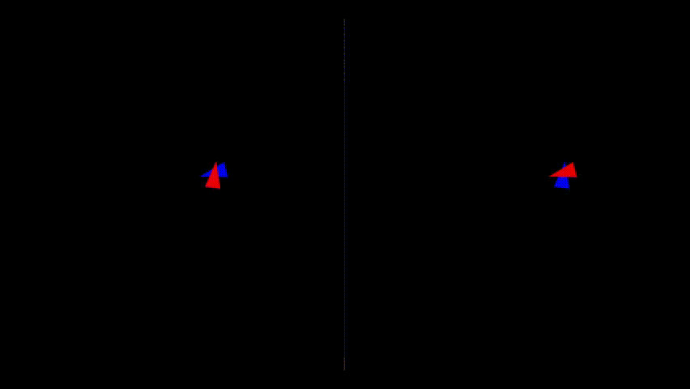

# Minimalist Multiplayer Shooter

This project constitutes the first experiment at creating a simple networked multiplayer game using the TCP protocol. The two players can move and fire projectiles, if one is hit by the other, their outline will turn white.

<div align="center">

</div>

## How it works

This project employs the SFML library for handling TCP operations and game management.

* First, the server is created, listening to a new connection on its port (53000 here).
* Then, a client is created and tries to connect to server's ip and port.
* Once done, the SFML window opens and the game begins.
* When a player moves or fires, the TCP socket sends a packet containing the player and shots' positions.
* The other player receives it and displays it.

## Installation

To run this project on your computer, you will need to have SFML installed. Here are the steps to install SFML and run this project:

* Download SFML from the official website [here](https://www.sfml-dev.org/download.php).
* Select the appropriate version for your operating system and extract the files to a directory of your choice.
* Download the source code for this project directly from this repository, or by cloning it using the command line:
```bash
git clone https://github.com/whazami/minimalist-multi-shooter.git
```
* Open the project in your preferred C++ IDE and configure the build settings to link SFML. You can find instructions for linking SFML in various C++ IDEs [here](https://www.sfml-dev.org/tutorials/2.5/start-vc.php).
* Build the project.

## How to use

* Before compiling the project, find your ip address by typing `ipconfig` on Windows or `ip addr` on Linux. Your address should starts by `192.168`.
* Assign the value of the `IP` constant on line 4 of `main.cpp` to your ip address.
* Once you build and launch the program, you will be asked to choose between server and client, press `s` to choose server.
* Launch the program a second time, but this time choose client by pressing `c`.
* The game should start, you can now focus one of the two SFML windows and control your player with these commands:

<div align="center">

| Move           | Rotate             | Fire       |
| :------------: | :----------------: | :--------: |
| WASD/ZQSD keys | Move mouse pointer | Left click |

</div>

## License

This project is licensed under the MIT license. See the [LICENSE](LICENSE) file for details.
